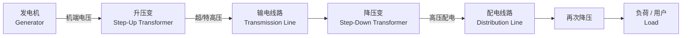

# Evaluation
+ Final Exam：50%
+ Homework：15%
+ Research Reports：25%
+ Experiment：10%
# 第 1 章 电力系统概述（Lecture 1）学习笔记
> 源文件：`01-EN第一章电力系统概述(第1讲).pdf`（共 25 张幻灯片）
> 授课教师：WANG Hui | 课件用 PowerPoint 制作，原文为英文
> 整理时间：2026-09-14
---
## 本讲提纲：本讲回答 6 个核心问题
1. **Why people prefer electricity?** — 人们为什么偏爱电能？
2. **What is a power system?** — 什么是电力系统？
3. **Components? How to represent?** — 电力系统由什么组成？怎样表示？
4. **Operation features and requirements?** — 运行的特征与要求是什么？
5. **Interconnected power system?** — 为什么要互联成大电网？
6. **How to control large-scale power systems?** — 大电网如何调度控制？
> 这 6 个问题串起了本章的所有内容，建议作为复习框架反复回头看。
---
## §1.1 为什么偏爱电能？Why People Prefer Electricity？
### 课堂引入
老师先用一个思想实验开场：**想象一个没有电的"平行世界"**——如果人类当年点错了科技树，今天会是什么样？由此引出电能在现代社会中的不可替代性。
### 电能的优点（Advantages）

| 原文（EN）                                                                               | 中文释义                            | 备注                   |
| ------------------------------------------------------------------------------------ | ------------------------------- | -------------------- |
| Clean (from the user's view): protect environment                                    | **清洁**（用户视角）：保护环境               | 注意是"用户侧清洁"，发电侧仍可能有排放 |
| Convenient: transportation, distribution, utilization                                | **便于输送**：易于运输、分配与使用             | 可远距离、低损耗输送           |
| Electrification: mechanization, automation, improve product quality and productivity | **电气化**：使机械化、自动化成为可能，提高产品质量与生产率 | 第二次工业革命以来            |
| Energy saving: low energy loss, high energy conversion efficiency                    | **节能**：传输损耗低，能量转换效率高            | 相比机械输送等              |

> **讨论题**：如何理解 *re-electrification*（再电气化）？
> 老师原话："Make Power System Great Again! ☺"——指在新能源、电动汽车、热泵等趋势下，电力系统在终端能源消费中的比重再次回升。
### 要点回顾
- 电能是**现代社会最重要的能源**。
- 用户侧"清洁"，但发电侧需关注碳排放。
- 再电气化是当前重要趋势（与"双碳"目标呼应）。
---
## §1.2 什么是电力系统？What is a Power System?
### 系统定义（System Definition）
> **A regularly interacting or interdependent group of items forming a unified whole for a specified function.**
> ——为完成某一特定功能，由若干相互联系、相互依赖的部件所组成的统一整体。
**问题**：电力系统由什么组成？完成什么功能？
### 电力系统定义（Power System Definition）
> A unified whole of performing **electricity generation, transmission, distribution, and consumption**. Normally a **three-phase AC/DC system** composed of **generators, transformers, power lines, and electrical loads**.
中文：完成**电能生产、输送、分配与消费**的统一整体。通常是三相交流（或直流）系统，由**发电机、变压器、输电线路和电力负荷**组成。
### 三个"最"
- **The most complicated man-made system**——人造系统中最复杂的一种。
- **20 世纪最伟大的 20 项工程成就之一，排名第一**（美国国家工程院评选）。
- **当今最大的产业之一**。
### 要点回顾
- "系统 = 部件 + 联系 + 整体功能"。
- 电力系统的四大环节：**发、输、配、用**。
- 系统极其复杂，且关乎国家安全。
---
## §1.3 电力系统的组成 Components
电力系统分两大子系统：

| 子系统                        | 主要内容                       | 电压等级    |
| -------------------------- | -------------------------- | ------- |
| **一次系统（Primary System）**   | 高电压、强电流的物理本体：发电机、变压器、线路、负荷 | **高电压** |
| **二次系统（Secondary System）** | 信息与运行系统：保护、监控、调度、通信        | **低电压** |
**核心规律**：**低电压控制高电压，小电流控制大电流，信息流控制能量流**。
> 💡 二次系统是后续研究生阶段、研究方向的主要选题来源（智能电网、能源互联网等都从这里延伸）。
### 一次系统的四大组成部件（Generation / Transmission / Load / Storage）

| 部件     | 英文              | 作用               | 典型形式                        |
| ------ | --------------- | ---------------- | --------------------------- |
| **电源** | Generators      | 一次能源 → 电能（能量转换）  | 火电 / 水电 / 核电 / 风电 / 光伏 / 地热 |
| **电网** | Power Networks  | 电能输送与分配          | 输电网 + 配电网                   |
| **负荷** | Load (customer) | 电能 → 其他形式能量      | 电动机 / 电灯 / 电炉               |
| **储能** | Storage         | 电能存储 / 转换为其他形式储能 | 抽水蓄能 / 电池 / 飞轮 / 压缩空气       |
> 储能是近年新增的"第四类"部件，电力系统正在从"发-输-配-用"四环节扩展为"发-输-配-用-储"五环节。
### 一次系统的典型电压等级（来自 §1.3 配图）

| 环节           | 电压等级                                       |
| ------------ | ------------------------------------------ |
| **超/特高压输电**  | 1000 kV、750 kV、500 kV、330 kV、220 kV、110 kV |
| **高压输电主网**   | 110 kV、220 kV                              |
| **高压配电**     | 35 kV、66 kV                                |
| **中压配电**     | 6 kV、10 kV                                 |
| **低压配电（用户）** | 220 V、380 V                                |
> 中国的电压等级体系参考自苏联/俄罗斯（330 kV、750 kV），与北美（230 kV、345 kV、500 kV、765 kV）有所区别。
### 一次系统结构示意图

颜色图例：
- 🔴 **红**：发电（Generation）
- 🔵 **蓝**：输电（Transmission）
- 🟢 **绿**：配电（Distribution）
- ⚫ **黑**：用户（Customer）
能量流：发电厂 → 升压变 → 输电线（高压）→ 变电站降压 → 高/中/低压配电 → 用户。
### 要点回顾
- 一次系统：物理、能量、强电；二次系统：信息、控制、弱电。
- 电源 / 电网 / 负荷 / 储能是现代电力系统的四大支柱。
- 电压等级体现"远距离大功率 → 逐级降压"的设计思想。
---
## §1.4 电力系统的表示方法 Power System Representation
### 三相电路图（Three-phase Circuit Diagram）
实际工程中要画完整三相太繁琐，先看一张"三相"图做对照。

> 三相图中：发电机 Y 接 → 升压变 Δ-Y → 输电线 Y-Y → 降压变 → 配电线路 → 用户侧再降压 → 负荷 Y 接（含中性点）。
### 单线图（Single-line Diagram）
> **Single-line Diagram**: Practical power systems are complex, whose three-phase connections are represented by single-line for easy reading.
把三相连接用**一根线**表示，每一类设备用约定的图形符号代替。


> 阅读方法：发电机 → 升压变 → 输电线路 → 降压变 → 配电线路 → 再降压变 → 负荷，每一段代表电力流的一个环节。
### 复杂动力系统的单线图（举例）
实际电网远不止一机一线。下面是带水电、火电、核电及不同等级用户的**复杂单线图**示例：

> 该图来自中文教材的典型案例，可看到水电（500 kV、220 kV）、火电（25 kV、220 kV、500 kV）、抽水蓄能（110 kV）、工业用户（10 kV）、居民用电（380/220 V）等层级。
### 简化复刻（mermaid 示意）


### 要点回顾
- **单线图 = 电力系统的"工程语言"**，是后续所有分析（潮流、短路、稳定）的基础图。
- 掌握常用符号：发电机、变压器（双圆/三绕组）、线路、断路器、负荷、接地。
---
## §1.5 更大尺度的动态系统 Larger Dynamic Systems
电力系统不是孤立系统，它与其他系统耦合：
- **Power networks**（电力网络）
- **Power plants**（电厂本体：锅炉、汽轮机、水轮机、核反应堆等）
- **Thermal networks**（热力网络 / 区域供热）
- **Energy Internet**（能源互联网）
> 老师观点：电力系统是**信息-物理-社会**深度耦合的复杂系统。研究它必须跳出"电气"边界，向能源、信息、社会行为延伸。
---
## §1.6 运行特点与要求 Operation Features and Requirements

电力不同于普通商品，有**三大特征**和**四大要求**。
### 三大特征 Features

| 特征      | 英文           | 中文解读                              |
| ------- | ------------ | --------------------------------- |
| **重要性** | Importance   | 电力中断直接影响生产生活乃至国家安全                |
| **快速性** | Rapidity     | 电磁/机电暂态过程以毫秒、秒计，远比一般工业过程快         |
| **同时性** | Simultaneity | **发、输、配、用瞬时平衡**，没有大规模可存储能力时必须实时平衡 |
### 四大要求 Requirements

| 要求       | 英文                       | 内涵                      |
| -------- | ------------------------ | ----------------------- |
| **高可靠性** | High reliability         | 按**负荷等级**（一类、二类、三类）区别对待 |
| **高质量**  | High quality             | 频率、电压、波形三项指标合格          |
| **经济性**  | Good economics           | 追求整体经济效益最优（不等于单价最低）     |
| **环境友好** | Environmentally friendly | 节能减排、与生态环境协调            |
> **核心结论**：电力是"特殊商品"——它的生产、输送、消费是同时完成的，且难以大规模存储。这一性质决定了后面所有调度与控制策略的基本出发点。
---
## §2 互联电力系统 Interconnected Power System
### 实际电网的样貌
- 北美互联电网（Western / Eastern Interconnection、Texas、Quebec 等）。
- 中国互联电网（华北、华东、华中、东北、西北、南方等区域电网，近年通过特高压连成"全国一张网"）。
课件中分别给出了北美、中国、未来世界级互联电网的示意图（page 15–18，受 PDF 导出限制，未渲染在此，可在原课件第 19、20、22、23 页查看）。
### 为什么要互联？Why Interconnected?

| 优点 | 中文 |
|---|---|
| Less total installed capacity | **总装机容量可减小**（电力交换） |
| Less reserved capacity | **备用容量可减小**（各区同时故障/检修概率低） |
| Improve reliability and quality | **可靠性与电能质量提高**（故障时相互支援） |
| More economical operation | **运行更经济**（水电、小火电、风电、光伏可在大范围内优化调度） |
| Install larger units to improve efficiency | **可装大容量机组**提高效率 |
### 互联带来的问题 Problems of Interconnection

| 问题              | 风险             |
| --------------- | -------------- |
| UHV/EHV 互联设备成本高 | 投资巨大           |
| 局部故障可能波及全网      | **连锁故障 / 大停电** |
| 更多并联回路、更大短路电流   | 保护配置复杂         |
| 安全风险与运行难度上升     | 需要更强调度自动化      |
### 典型风险：连锁故障（Domino Effect）

典型连锁过程（课件示例）：
```
DC Failure（直流故障）
    ↓
Power from DC to AC Lines（潮流从直流倒向交流）
    ↓
AC Voltage Drop（交流电压下降）
    ↓
Generator Speed Up / Slow Down（发电机转速变化）
    ↓
Angle Stability Risk（功角稳定破坏）
```
> 历史上多次大停电（如 2003 美加大停电、2012 印度大停电）都呈现这种**多米诺骨牌**特征。这也是后几章要专门讲**电力系统稳定性**的动机。
### 要点回顾
- 互联 = **更强的资源调配能力 + 更高的连锁故障风险**。
- 大电网是双刃剑：必须用调度自动化和分层控制去化解风险。
---
## §3 大电网如何控制？How to Control Large-Scale Power Systems?
### 三大解决方案
1. **集中管理（Centralized Management）**：统一目标，统筹安全与经济。
2. **分层控制（Hierarchical Control）**：**五级调度**（国调 / 网调 / 省调 / 地调 / 县调）。
3. **调度自动化（Dispatch Automation）**：以计算机、通信、控制技术为基础，对电网运行进行**实时监控、分析、控制**。
> 调度自动化的目标：**辅助调度员维持电网安全、可靠、经济运行**。
### 中国五级调度体系

```
National Power Dispatching and Control Center（国调）
├── Northeast China   （东北） ─ Liaoning / Jilin / Heilongjiang / East Inner Mongolia
├── North China       （华北） ─ Hebei / Shanxi / West Inner Mongolia / Beijing / Tianjin
├── Central China     （华中） ─ Hubei / Hunan / Henan / Jiangxi
│                                     ├── District 1（地调）
│                                     │   ├── County 1（县调）
│                                     │   ├── ...
│                                     │   └── County M
│                                     └── District N
├── East China        （华东） ─ ...
└── …（其他大区）
```
> **国调直接调度各大区**，大区调度管省级，省调管地调，地调管县调，层层落实。
### 实际调度中心与新形态

- 大屏可视化、SCADA、EMS 是现代调度中心的标配。
- **微电网 EMS（Energy Management System）** 是新形态：让局域"发-储-用"也能独立自主优化。

> 新电力系统的典型场景：风电、光伏、储能、电动汽车深度参与，海陆统筹、源网荷储一体化。
### 要点回顾
- **集中 + 分层 + 自动化** 是大电网控制的三根支柱。
- 五级调度是中国电网运行的关键组织架构。
- 新电力系统 = 新能源高渗透 + 储能 + 数字化调度。
---
## 关键术语 Glossary（中英对照）

| 中文 | English | 说明 |
|---|---|---|
| 一次系统 | Primary system | 高电压、强电流的物理本体 |
| 二次系统 | Secondary system | 保护、监控、通信、调度 |
| 发电机 | Generator | 一次能源→电能的转换装置 |
| 变压器 | Transformer | 升压 / 降压变（Step-up / Step-down） |
| 输电线路 | Transmission line | 远距离大功率输送 |
| 配电线路 | Distribution line | 终端分配 |
| 负荷 / 用户 | Load / Customer | 电能消费侧 |
| 储能 | Storage | 抽蓄 / 电池 / 飞轮 / 压缩空气 |
| 单线图 | Single-line diagram | 用一根线表示三相连接 |
| 三相交流 | Three-phase AC | 现代电网主流形式 |
| 调度 | Dispatch | 实时指挥电网运行 |
| 互联电网 | Interconnected power system | 跨区域互联的大电网 |
| 连锁故障 | Domino / Cascading failure | 局部故障扩散 |
| 调度自动化 | Dispatch automation | 计算机+通信+控制 |
| 能量管理系统 | EMS (Energy Management System) | 调度中心的核心软件系统 |
| 微电网 | Microgrid | 局部可独立运行的"小电网" |
| 能源互联网 | Energy Internet | 多能互补、信息化、融合 |

---
## 思考题 / 自测
1. **为什么说电力是"特殊商品"？** 请用"同时性"和"难以大规模存储"两条性质解释为何电力必须实时平衡。
2. **一次系统 vs 二次系统**：两者的电压/电流等级关系是什么？设计思路如何？
3. **电压等级阶梯**：从 1000 kV 到 220 V，对应的环节分别是什么？为什么不能直接高压入户？
4. **单线图与三相图的取舍**：在工程中为什么单线图更常用？什么场合必须用三相图？
5. **互联的利弊**：用 3 条以上的"利"与 2 条以上的"弊"对比，并各举一个真实场景。
6. **五级调度**：当某 500 kV 主干线在华东故障时，国调、网调、省调、地调、县调分别可能采取哪些动作？
7. **延伸阅读**：查找 2003 年美加大停电或 2012 年印度大停电的事故链，验证"Domino"模型。
---
## 备注
- 本笔记对应课件第 1 章第 1 讲（共 2 讲），下一讲会继续展开建模与稳态分析。
- 课件 PDF 中存在动画分步（部分幻灯片页码跳号 13→14→15→16→19→20→22→23→24→25），说明 PPT 里有多步动画，PDF 导出时已合并显示。
- 配套词汇表参见：`中英单词对照表 (1).pdf`。
